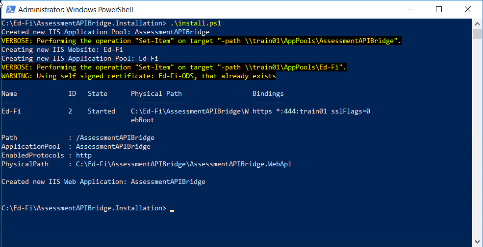

# Ed-Fi Assessment API Bridge Installer

## Overview

This solution contains PowerShell installation scripts and its configuration for Assessment API Bridge. 

These scripts are provided as-is, but the Alliance welcomes feedback on
additions or changes that would make these resources more user friendly.
Feedback is best shared by raising a ticket on the Ed-Fi Tracker [Ed-Fi Alliance Project](https://tracker.ed-fi.org/projects/EDFI).


## PowerShell Installation


### Installation Steps

**Step 1. Create Assessment API Bridge Directory**

Create a directory to hold all of the Assessment API Bridge source files. For this example, we will use "C:\Ed-Fi\AssessmentAPIBridge".


**Step 2. Unzip Assessment API Bridge Source Files**

Unzip the contents of the Source ZIP into the folder created in Step 1.


**Step 3. Unzip Assessment API Bridge Installation Files** 

Unzip the contents of the Installation ZIP into any folder of your choice. For this example, we will unzip to this path "C:\Ed-Fi\AssessmentAPIBridge.Installation".


**Step 4 Configure Installation**.

Open the "C:\Ed-Fi\AssessmentAPIBridge.Installation\install-config.json" file. You will need to edit this file with your configuration details.

```
{
  "application": {
    "descriptorNamespacePrefix": "http://ed-fi.org/",
    "includeSchoolYearInUpstreamRoute": "false",
    "upstreamEdFiApiUrl": "https://api.ed-fi.org/v3.2.0/api/",
  },
  "webapi": {
    "installationDirectory": "C:\\Ed-Fi\\AssessmentAPIBridge",
    "iis": {
      "appPoolUserDomain": "",
      "appPoolUser": "",
      "appPoolPassword": "",
      "webApplicationName": "AssessmentAPIBridge",
      "websitePort": 444
    }
  }
}
```
Configure Application Settings
* In 3.x ODS / API descriptors need to be fully qualified. Set "descriptorNamespacePrefix" to be used if 2.x Assessment API request didn't include the namespace.
 We recommend matching this to DescriptorNamespacePrefix entry in your earlier 2.x ODS / API Web.config. For more details on this ODS / API setting, see [ODS / API Configuration Details](https://techdocs.ed-fi.org/display/ODSAPI26/Configuration+Details).
* In 3.x ODS / API school year is not required in the route. Set "includeSchoolYearInUpstreamRoute" to true if your upstream 3.x ODS / API is set up for year specific routes.
* Set "upstreamEdFiApiUrl" to the upstream 3.x ODS / API URL.

Configure WebAPI
* Set the "installationDirectory" to the path of the directory with the source files. Be sure to escape any special characters like slashes (For example, a path like ```"C:\Ed-Fi\AssessmentAPIBridge"``` should be changed to ```"C:\\Ed-Fi\\AssessmentAPIBridge"```).
* If you desire, you may customize the IIS Application Pool context by providing local machine user credentials or Active Directory credentials.  Otherwise, leave username and password empty for the default application pool identity.


**Step 5. Run the Installation via PowerShell** 

Ensure that you have permission to execute PowerShell scripts. For more information, see http://go.microsoft.com/fwlink/?LinkID=135170.

Launch PowerShell as an administrator, cd to the directory containing the installation files, and run the "install.ps1" script.

The PowerShell output should look like the following:



**Step 6.Confirm installation in IIS Manager** 

Open IIS Manager, and confirm a Assessment API Bridge exists under the Ed-Fi site.


### Uninstall Instructions

**Step 1. Run the Uninstall Script via PowerShell**

Launch PowerShell as an administrator, cd to the directory containing the installation files, and run the "uninstall.ps1" script. The PowerShell output should look like the following:


**Step 2. Clear out source file directory**
In the directory with the Assessment API Bridge source files, delete all folders and files to be at a clean state. In our case, the directory was "C:\Ed-Fi\AssessmentAPIBridge". This will make future installations easier.